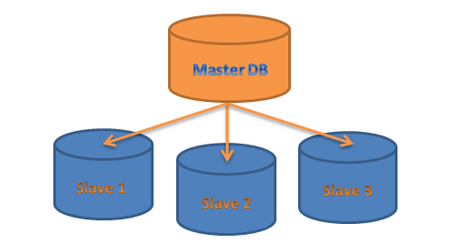

# Database Replication :
__________________________

## Master slave replication :
____________________________________
Master-slave replication enables data from one database server (the master) to be replicated to one or more other database servers (the slaves). The master logs the updates, which then ripple through to the slaves. The slave outputs a message stating that it has received the update successfully, thus allowing the sending of subsequent updates. Master-slave replication can be either synchronous or asynchronous. The difference is simply the timing of propagation of changes. If the changes are made to the master and slave at the same time, it is synchronous. If changes are queued up and written later, it is asynchronous.

